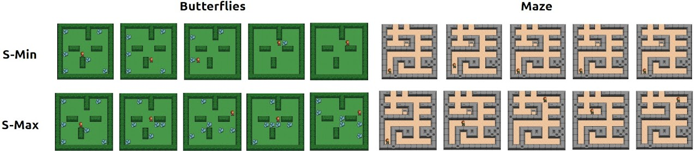

# 🎉 Surprise-Adaptive Intrinsic Motivation for Unsupervised Reinforcement Learning 🚀

Official codebase for our paper [Surprise-Adaptive Intrinsic Motivation for Unsupervised Reinforcement Learning](https://rlj.cs.umass.edu/2024/papers/Paper77.html), authored by Adriana Hugessen (\*), Roger Creus Castanyer (\*), Faisal Mohamed (\*), and Glen Berseth.

📝 Published at: Reinforcement Learning Conference 2024

🏫 Affiliations: Work conducted at Mila Quebec and Université de Montréal

📄 Full Paper: [Read here](https://rlj.cs.umass.edu/2024/papers/Paper77.html)

🌐 Project Website: [Explore here](https://sites.google.com/view/surprise-adaptive-agents/home)


### 📜 Abstract 
Both entropy-minimizing and entropy-maximizing objectives for unsupervised reinforcement learning (RL) have been shown to be effective in different environments, depending on the environment's level of natural entropy. However, neither method alone results in an agent that will consistently learn intelligent behavior across environments. In an effort to find a single entropy-based method that will encourage emergent behaviors in any environment, we propose an agent that can adapt its objective online, depending on the entropy conditions it faces in the environment, by framing the choice as a multi-armed bandit problem. We devise a novel intrinsic feedback signal for the bandit, which captures the agent's ability to control the entropy in its environment. We demonstrate that such agents can learn to optimize task returns through entropy control alone in didactic environments for both high- and low-entropy regimes and learn skillful behaviors in certain benchmark tasks.

<p align="center"></p>

### 🛠️ Installation 
```bash
# clone the repo 
git clone https://github.com/roger-creus/surprise-adaptive-agents.git
cd surprise-adaptive-agents
# install requirement via conda
conda create --name s_adapt python=3.9.18
pip install -r requirements.txt
pip install -e .
```
### 🧪 Running Experiments
To launce an experiments you can run the following
```bash
python scripts/cleanrl_dqn.py --env_id=griddly-ButterfliesEnvLarge --model=sadapt-bandit --buffer_type=bernoulli 1 --normalize_int_reward=1 --soft_reset=0 --total_timesteps=15_000_000 --exploration_fraction=0.5 
```
Check the file ```gymnasium_wrappers/args.py``` to knwo more about the algorithm hyperparametrs.


### 🌍 Supported Environments
| Environment name    | ID |
| -------- | ------- |
| Large Butterflies  | griddly-ButterfliesEnvLarge    |
| Small Butterflies | griddly-ButterfliesEnv |
| Small Maze    | griddly-MazeEnv    |
| Large Maze    | griddly-MazeEnvLarge    |
| Breakout(MinAtar)    | MinAtar/Breakout    |
| Freeway(MinAtar)    | MinAtar/Freeway    |
| Seaquest(MinAtar)    | MinAtar/Seaquest    |
| SpaceInvaders(MinAtar)    | MinAtar/SpaceInvaders    |
| Asterix(MinAtar)    | MinAtar/Asterix    |
